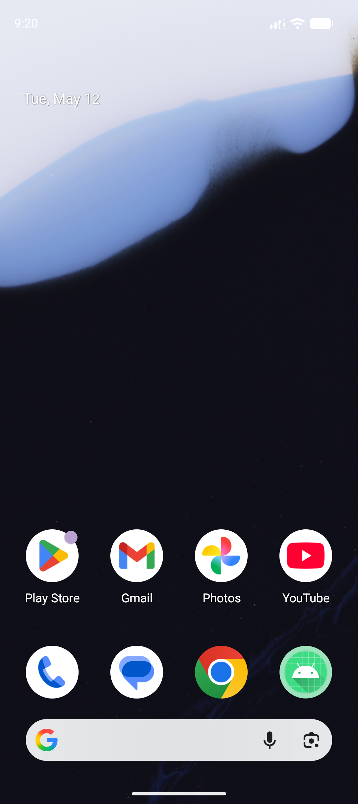

# Novel Voice Reader

Novel Voice Reader is an Android app for turning web novel chapters into clean, listenable text-to-speech. Paste or share a chapter URL, let the app strip page clutter, and listen in a reader-first interface with playback controls, chapter navigation, offline saves, and background audio.



## Features

- Direct chapter extraction for supported web novel pages.
- Browser fallback for pages that need WebView rendering.
- Reader mode with adjustable text size and active sentence highlighting.
- Android text-to-speech playback with voice and speed controls.
- Foreground playback service for listening with the screen off.
- Previous and next chapter navigation from real page links when available.
- Saved library chapters and future chapter preloading.
- Sleep timer options for time-based or chapter-based stopping.
- Share-sheet support for sending chapter links into the app.

## Supported Sources

The parser is designed around clean chapter extraction and currently has targeted coverage for:

- NovelFire-style chapter pages
- Divine Dao Library-style chapter pages
- LightNovelWorld chapter pages, including URLs like `https://lightnovelworld.org/novel/who-let-him-cultivate/chapter/93/`
- LightNovelPub chapter pages, including URLs like `https://lightnovelpub.org/novel/shadow-slave/chapter/1/`
- NovelBin chapter pages, including URLs like `https://novelbin.me/novel-book/turning/chapter-1`
- NovelBuddy chapter pages, including URLs like `https://novelbuddy.com/super-gene/chapter-3462end-epilogue`
- Novelight chapter pages, including URLs like `https://novelight.net/book/chapter/229529`
- NovelFull chapter pages, including URLs like `https://novelfull.net/the-99th-divorce/chapter-1-who-was-the-murderer.html`
- NovelRoll chapter pages, including URLs like `https://novelroll.com/book/i-can-copy-talents/chapter-2150`
- Royal Road chapter pages
- WuxiaWorld chapter pages, including URLs like `https://www.wuxiaworld.com/novel/child-of-light/col-volume-1-chapter-1`
- Generic article/main/content containers as a fallback

Some sites may still fail if they hide chapter text behind scripts, login gates, unusual markup, or aggressive bot protection. Contributions that add focused parser fixtures are very welcome.

## Requirements

- Android Studio with the bundled JDK, or another Java 17+ installation
- Android SDK for compile SDK 36
- A device or emulator running Android 8.0 or newer, because `minSdk` is 26

## Getting Started

Clone the repo:

```powershell
git clone https://github.com/YOUR_USERNAME/NovelVoiceReader.git
cd NovelVoiceReader
```

Build a debug APK:

```powershell
$env:JAVA_HOME='C:\Program Files\Android\Android Studio\jbr'
$env:PATH="$env:JAVA_HOME\bin;$env:PATH"
.\gradlew.bat assembleDebug
```

Run unit tests:

```powershell
$env:JAVA_HOME='C:\Program Files\Android\Android Studio\jbr'
$env:PATH="$env:JAVA_HOME\bin;$env:PATH"
.\gradlew.bat testDebugUnitTest
```

On macOS or Linux, use `./gradlew assembleDebug` and `./gradlew testDebugUnitTest`.

## Project Structure

```text
app/src/main/java/com/example/novelvoicereader/
  MainActivity.kt                  UI, WebView fallback extraction, playback controls
  PlaybackService.kt               Foreground text-to-speech playback
  data/
    DirectChapterFetcher.kt         Lightweight HTTP chapter extraction
    ChapterPrefsRepository.kt       Saved/current chapter persistence
    WebContentBlocker.kt            Basic WebView resource blocking
  domain/
    model/                          Chapter and sleep timer models
    repository/                     Repository contract
    usecase/                        Small chapter/library operations
```

## Adding a Site

1. Capture a small representative HTML fixture for the chapter page.
2. Add a parser test in `DirectChapterFetcherTest` that proves the first narrated line, footer cleanup, ad removal, and previous/next links.
3. Update `DirectChapterFetcher` with the narrowest selector or cleanup rule that supports the site.
4. If the site needs browser rendering, mirror the selector in the WebView extractor in `MainActivity`.
5. Run `testDebugUnitTest` before opening a pull request.

## Repository Hygiene

Generated build outputs, release APKs, Android Studio workspace state, and local SDK paths are intentionally ignored. Keep commits focused on source, tests, docs, and intentional assets.

## Notes

Novel Voice Reader is meant for personal reading and accessibility workflows. Please respect authors, translators, publishers, and each website's terms when using or extending the app.

## License

No license has been selected yet. Add a license file before publishing the repository if you want to clearly define how others may use, fork, and redistribute the code.
